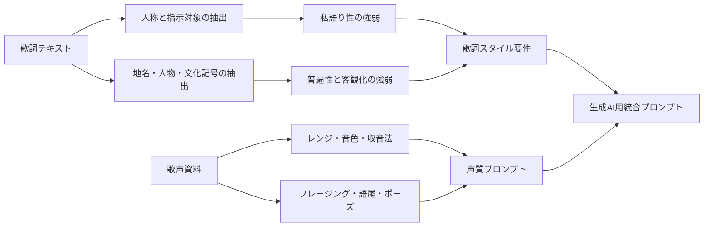

「frame, flame, hollow, echo, mimic, hum, script, verdict, borrow, noの連続」は使わないように
日本語は「余白」を使わないように

# レッド・ホット・チリ・ペッパーズとラナ・デル・レイにおける普遍的視点の歌詞と歌声の音響表現分析

## エグゼクティブサマリー

本調査の結論を先に述べると、**Red Hot Chili Peppers は「地名・文化記号・第三者人物」を前景化することで、一人称の私語りから距離を取った“公共的な歌詞空間”を作る傾向が強い**のに対し、**Lana Del Rey は“映画的な人物造形”と“類型化された相手への呼びかけ”を使って、一人称を残しながらも個人的告白を神話化・客観化する傾向が強い**と言える、という点にある。前者では *Californication* や *Dani California* のように、地理・産業・人物像が歌詞の主役になりやすい。後者では *Carmen* のような第三者人物描写、あるいは *Norman Fucking Rockwell* や *The greatest* のような「特定の誰か」を越えて類型・文化状況を語る書き方が重要である。したがって、両者に共通するのは「自己の内面をそのまま吐露する」のではなく、**人物類型・場所・文化符号・風景を媒介して意味を外在化する**ことだが、その外在化の方法は RHCP がより“地図的・公共的”、Lana がより“映画的・寓話的”である。 citeturn42view1turn42view0turn43view0turn42view3turn42view4turn16view1turn38search1

歌声については、**Anthony Kiedis は前方共鳴感の強い、発話寄り・リズム優位・子音駆動のロック／ファンク的デリバリー**が核にあり、制作サイドの記述でも Shure SM7 や Audix OM7 といった近接的で存在感の出やすいマイク運用、さらに低中域を整理してプレゼンスを上げる処理が言及されている。対して **Lana Del Rey は近接収音された、低域に重心のある、息成分を伴う親密なレガート歌唱**が核であり、Apple Music は彼女の balladry を “glamorous melancholy” と要約し、Pitchfork は *Mariners Apartment Complex* で “whispers as much as sings” と評している。つまり、Kiedis の声は**ことばを前へ押し出して外部世界を指し示す**方向に働き、Lana の声は**距離を詰めて像を霧化し、物語を映画のように包む**方向に働く。 citeturn17search0turn37search0turn37search2turn39search0turn35search0turn38search0turn38search1turn38search10

生成AI用プロンプトへ落とし込む際の要点は明確である。歌詞生成では、**一人称の感情語を減らし、かわりに場所・文化記号・人物類型・観察文・第二人称一般化を増やす**こと。音声合成・歌唱表現指示では、RHCP 系なら**短いアタック、強い子音、節ごとの押し引き、半ば話すようなフレージング**を指定し、Lana 系なら**低めの息声スタート、長い母音、語尾の細い減衰、近接した親密感、狭めのビブラート**を指定するのが有効である。なお、対象曲数と具体曲はユーザー要件上「未指定」であり、本レポートでは代表例抽出という形でコーパスを構成した。 citeturn42view1turn42view0turn42view3turn42view4turn17search0turn37search0turn35search0turn38search0

## 目的と範囲

本レポートの**目的**は、Red Hot Chili Peppers と Lana Del Rey を参照しつつ、**歌詞が個人の一人称視点に閉じず、より普遍的・客観的・外在化された視点で歌われる楽曲の特徴**を整理し、そのうえで**両者の歌声の音響的・表現的特徴**を分析し、最後にそれらを**生成AI用プロンプト**へ変換することである。対象アーティストは **Red Hot Chili Peppers** と **Lana Del Rey** である。対象楽曲数は要件上**未指定**であるため、本報告では代表例として RHCP から *Californication*、*Otherside*、*Dani California*、Lana から *Carmen*、*Norman Fucking Rockwell*、*The greatest* を主に歌詞分析に用い、歌声分析では譜面レンジや制作資料が入手しやすい別曲も補助的に参照した。 citeturn16view2turn16view1turn25search16turn38search1

また、ユーザー要件に従い、**音源解析に利用可能な高品質音源があるかは不明**である。そのため本レポートでは、公開ソースから確認できる事項と、**高品質音源が利用可能であると仮定した場合の再現可能な分析手法**を分けて示す。歌詞ソースは、可能な限り**アーティスト公式ページ・Apple Music のアーティスト／アルバム解説・公式/ライセンス系譜面・原語資料**を優先し、歌詞本文の可視化についてはアクセス可能な歌詞資料を補助的に用いた。日本語訳は既存訳が一部に限られたため、**原語に基づく筆者訳**を主とし、既存の日本語訳公開ページは補助参照にとどめた。Musicnotes は「officially licensed sheet music」と明示しており、譜面レンジの参照元としては優先度が高い。 citeturn6search3turn33search0turn31search5turn30view0turn30view1turn30view2

本調査での**ソース優先順位**は以下の順に置いた。まず、公式アーティスト／レーベル／公式配信プラットフォームの解説。次に、ライセンス譜面と制作・録音インタビュー。次に、音声学・音響学の学術文献。最後に、歌詞へのアクセスのための補助的歌詞資料である。Lana Del Rey と RHCP の概要については Apple Music 上のアーティスト記述が、それぞれ「new American mythology」や LA 的二面性とファンク／パンク融合を簡潔に要約しており、本報告の外在化・神話化という観点と整合的である。 citeturn38search1turn16view2

## 分析方法と評価軸

本レポートでは、「普遍的・客観的な視点」を**文学理論上の厳密な“無人称”**に限定せず、実務上の作詞分析に使える**操作的定義**として以下のように定める。すなわち、**一人称 “I / me / my” の量が少ない、または一人称が使われていても意味の中心が自己告白ではなく、場所・人物類型・社会風景・文化状況へ移っていること**。さらに、**第二人称 “you” が固有の恋人ではなく、一般化された対象・社会類型・読者的位置を帯びること**、**第三人称人物が寓話的に配置されること**、**比喩が内的感情ではなく外部の景観や文化装置へ投射されること**を、客観化の指標とした。これにより、Lana のように一人称を残しつつも神話化・映画化によって私語りを超えるケースも分析対象に入る。 *Norman Fucking Rockwell!* が「inflated egos の研究」と説明され、*The greatest* や *Mariners Apartment Complex* が文化状況や神話的参照を帯びるという外部記述は、この定義の妥当性を補強する。 citeturn16view1turn38search0turn38news35

音響分析では、**ピッチレンジ、音色、フォルマント傾向、ビブラート、ダイナミクス、アーティキュレーション、発声法**を主要軸とした。ただし、アクセス可能な公開資料から得られる数値は、主として**譜面上の voice range、テンポ、収音・ミキシング情報**に限られる。フォルマントは vocal tract resonance によって知覚される timbre を規定し、singer’s formant は一般に 2–4 kHz 付近のエネルギー集中と関係づけられる。ビブラートは F0 と強度の周期変調として定義できる。したがって、実測が可能なら F0 軌跡、H1-H2、CPP、LTAS、スペクトル重心、2–4 kHz 帯エネルギー、ビブラート速度・深さ、ポーズ長を抽出するのが妥当である。 citeturn9search22turn14view0turn10search12turn9search4

さらに、感情表現については、歌唱音声研究が**sadness / tenderness と anger / happiness の間に頑強な音響的差異がある**ことを報告しているため、Lana の親密・低活性・息成分の多い歌唱と、Kiedis の発話寄り・前景化された子音・リズム駆動型歌唱を、単なる主観評ではなく**活性度・親密度・投射性の差**として位置づけた。息っぽさについては breathy vocal quality の acoustic correlate が長年研究されており、少なくとも H1-H2、スペクトル傾斜、雑音成分、CPP などが有力候補になる。 citeturn9search1turn10search7turn10search15

## 歌詞分析

### 視点と普遍性の定義

RHCP の歌詞で客観化が強く現れるとき、中心になるのは**固有地名、メディア産業、社会的イメージ、第三者人物**である。*Californication* では“中国”“Sweden”“Hollywood”といった地理・産業・文化がリリックの駆動源であり、語り手の心情よりも**時代風景のモンタージュ**が先に立つ。*Dani California* では “Dani” という人物の移動・犯罪・生存が連続し、個人的告白ではなく**アメリカ神話の断片的ロードムービー**として機能する。*Otherside* は一見一人称色が強いが、反復される “otherside” の比喩が個人的体験を一般化し、再生と境界越えの**寓話的な閾**として働く。 citeturn42view1turn42view0turn42view2

Lana Del Rey の場合、客観化は RHCP のような公共空間の地図化よりも、**人物の像を映画の画角で固定すること**、または**相手を人類学的な“男”の類型にしてしまうこと**によって達成される。*Carmen* は第三人称女子像を徹底的にスタイライズした曲であり、自己告白ではなく**観察と演出**の歌である。*Norman Fucking Rockwell* は “you” に対して語られるが、反復される “you’re just a man” により、相手は個人名を超えた類型へ一般化される。*The greatest* は確かに一人称を多く含むが、“nobody warns you before the fall” や “the culture is lit” のように、喪失の主題が個人的恋愛から**文化史的終末感**へ拡張されている。Apple Music が Lana を「new American mythology」の書き手と要約し、Pitchfork が彼女の語りを “modern Greek mythology” のようだと形容するのは、この神話化・客観化の傾向を裏づける。 citeturn43view0turn42view3turn42view4turn38search1turn38search0

### 具体例比較表

著作権配慮のため、歌詞引用は**短いフレーズ**のみに限定する。日本語欄は原語に基づく**筆者訳**である。既存日本語訳が確認できたものは補助参照をソース欄に添えた。 citeturn31search5turn30view0turn30view1turn30view2

| アーティスト | 楽曲 | 視点類型 | 短い原文引用 | 日本語訳 | 普遍性・客観性の核 | 解釈 |
|---|---|---|---|---|---|---|
| RHCP | *Californication* | 三人称＋地理・文化列挙 | “Psychic spies from China” / “Hollywood / Sells Californication” | 「中国からの超能力的スパイ」／「ハリウッドは“カリフォルニ化”を売る」 | 地名・国家・産業を並置し、自己告白ではなく文明批評へ開く | 話者よりも**文化システム**が主語になる。普遍性は“場所の寓話化”によって生じる。 citeturn42view1turn31search5 |
| RHCP | *Dani California* | 三人称人物叙述 | “Gettin’ born in the state of Mississippi” / “Just another way to survive” | 「ミシシッピに生まれ」／「それもまた生き延びる術」 | 個人の“私”ではなく、人物像と移動の連鎖で意味を作る | 断章的伝記として読め、**個人的内面より人物神話**が前景化される。 citeturn42view0turn30view2 |
| RHCP | *Otherside* | 一人称ありだが寓話化された境界語 | “How long will I slide” / “born again” | 「どれだけ滑り落ちるのか」／「そして再び生まれる」 | “otherside” が依存・再生・越境の抽象記号になる | 私語りを素材にしつつ、反復によって**一般化された境界経験**へ転換している。 citeturn42view2 |
| Lana | *Carmen* | 三人称人物描写 | “The boys, the girls” / “mind’s like a diamond” | 「男も女もカルメンを好く」／「その心はダイヤのよう」 | 主体は観察者であり、中心は“カルメン像”の演出 | 典型的な**映画的キャラクター・ソング**で、客観化がもっとも明瞭。 citeturn26search0turn43view0 |
| Lana | *Norman Fucking Rockwell* | 二人称だが類型化 | “you’re just a man” | 「あなたは結局ただの男」 | “you” を具体的人物から“男という類型”へ一般化 | 一人称は残るが、焦点は相手個人ではなく**男性性の記号化**に移る。 citeturn42view3turn30view0 |
| Lana | *The greatest* | 一人称回想＋文化診断 | “nobody warns you before the fall” / “The culture is lit” | 「転落の前に誰も警告しない」／「文化は燃えていた」 | 個人的記憶が文化喪失の叙景に接続される | 自伝的な入口から入っても、結論は**時代感情の総括**へ広がる。 citeturn42view4turn30view1 |

### 重要な比較所見

RHCP の普遍化は、**一人称を“減らす”ことそのもの**で成り立つ場合が多い。特に *Californication* と *Dani California* では、話者が見えにくく、そのぶん読者は歌詞を**場所・制度・人物神話の連結図**として受け取る。結果として、歌詞は「だれかの告白」というよりも「共同で共有できる外部世界のイメージ」になる。Apple Music の RHCP 紹介が、彼らを LA の光と陰を体現するバンドとし、パンクとファンクの融合として要約していることは、こうした**都市記号中心の語り**と相性がよい。 citeturn16view2turn42view1turn42view0

Lana は逆に、一人称を完全には捨てない。にもかかわらず客観性が成立するのは、**一人称の感情がそのまま露出する前に、映画・神話・類型・時代風景のフィルターを必ず通る**からである。*Carmen* では観察の画角、*Norman Fucking Rockwell* では “man-child” や “just a man” という類型語、*The greatest* では文化全体への哀歌が、その媒介装置として働く。Apple Music が Lana を「新しいアメリカ神話」を書く作家と位置づけるのは、その意味で極めて正確である。 citeturn38search1turn16view1turn42view3turn42view4turn43view0

## 歌声の音響的・表現的分析

アーティスト固有のフォルマント値やビブラート速度・深さを、査読済み公開資料から直接取得することは本調査ではできなかった。そのためここでは、**公開資料から確認できる定量情報**と、**高品質音源が利用可能と仮定した場合の測定設計・推定傾向**を分けて示す。一般理論として、formant は vocal tract resonance に由来する timbre の主要成分であり、singer’s formant は 2–4 kHz 付近のエネルギー集中として説明される。Titze は歌唱時の formant 観察に 0–5000 Hz の spectrogram、25 ms 窓、90 dB dynamic range を用いる例を示している。 vibrato は F0 と強度の周期変調であり、感情の違いは歌唱音声に頑健な音響差を生む。 citeturn9search22turn14view0turn10search12turn9search2turn9search4turn9search1

iturn15image1turn15image2turn15image3turn15image0

上の図像群は、artist-specific な測定結果ではなく、**歌唱音声のスペクトル／フォルマント／singer’s formant を理解するための視覚補助**である。ResearchGate 上の baritone speech vs. singing spectrogram は話声と歌声の 3 kHz 近傍エネルギー差を例示し、Ken Bozeman の図は F3–F5 の cluster を模式的に示し、Voce Vista 系の可視化例は harmonics と spectral envelope の見え方を把握するのに有用である。あくまで概念図だが、RHCP と Lana の比較でも、「前へ出るプレゼンス」と「近接親密な低中域の包み」を見分ける観点として有効である。 citeturn15image1turn15image2turn15image3turn15image0

### 公開資料から確認できる音響と制作上の手がかり

| 項目 | Anthony Kiedis | Lana Del Rey |
|---|---|---|
| 代表的な譜面レンジ | *Otherside* は Musicnotes で Voice range E4–G5、*Dani California* は G4–B5 と記載。補助的な singability source では *Otherside* E3–G4、*Dani California* G3–B4、*Californication* E3–A4 とされ、実際の印象としては**中域中心の発話的テシトゥラ**が強い。 citeturn33search8turn34search3turn33search5turn34search5turn5search8 | *Carmen* は C#3–B4、*Video Games* は E3–A4、*The greatest* は D3–C5、*Once Upon a Dream* は D4–F5 と記載され、**低域から中高域までを滑らかにつなぐが、中心は低〜中域**にある。 citeturn33search1turn6search10turn34search10turn6search12 |
| 収音・マイク | *Black Summer* で lead vocal は Shure SM7。ライヴでは Audix OM7 を継続使用し、Kiedis は「certain ways」で mic を cupping して効果を作るとされる。これは**近接・直接的・存在感重視**の運用を示唆する。 citeturn37search0turn37search2turn37search8 | Laura Sisk の記述では Lana の vocal は control room で Wunder CM7 S valve microphone により録音される。近接収音かつ一貫性の高いチェーンは、**親密で微細な息成分や語尾変化の保持**に有利である。 citeturn35search0 |
| ミックス上の声質ヒント | Ryan Hewitt は Rick Rubin の要望を受け、Kiedis を「younger」に聞かせるため**low-mid を減らし、presence を上げた**と述べる。これは Kiedis 声の評価軸が、重い低中域ではなく**前に出る中高域の明瞭さ**にあることを示す。 citeturn17search0 | Apple Music は Lana の歌を “jaded balladry” と “glamorous melancholy” で要約し、Pitchfork は “whispers as much as sings” と述べる。制作・受容の双方が、**息成分・近距離感・メランコリックな浮遊感**を核と見ている。 citeturn38search1turn38search0turn38search10 |
| 方向性の総括 | **speech-song、前方投射、子音駆動、プレゼンス優位**。ロック／ファンク文脈で、語の輪郭を前面に押し出す。 citeturn39search0turn17search0turn37search0 | **breathy-modal、低中域の暖色、長母音、近接親密、レガート優位**。バラッド文脈で、語の輪郭より空気感と持続を聴かせる。 citeturn35search0turn38search0turn38search1turn38search10 |

### 高品質音源が利用可能と仮定した定量分析設計

以下は、Praat / Parselmouth / librosa 系で再現可能な**測定プロトコル**である。右欄の「想定傾向」は、公開制作資料と歌唱スタイル記述からの**推定**であり、実測値ではない。 citeturn9search2turn9search4turn10search7turn14view0

| 指標 | 測定意義 | Anthony Kiedis 想定傾向 | Lana Del Rey 想定傾向 |
|---|---|---|---|
| F0 中央値・IQR | 実効的ピッチ中心と旋律変動幅 | 節ごとの狭め〜中程度の変動。**リズム優先で音高より語勢**が前面に出やすい。 citeturn39search0turn37search0 | 低〜中域に重心を置きつつ、語尾やサビで上方へ滑る。**低域の安定と上方への柔らかい拡張**。 citeturn33search1turn34search10turn38search10 |
| H1-H2 / CPP | breathiness と声門閉鎖の傾向 | 中程度〜低めの H1-H2、CPP は比較的高めを想定。**息漏れより前方成分**。 citeturn17search0turn37search2turn10search7 | H1-H2 やスペクトル傾斜は相対的に高め、CPP は弱めの箇所が増える可能性。**息声混じりの親密さ**。 citeturn38search0turn35search0turn10search7 |
| LTAS・スペクトル重心 | 声の明るさ／暗さ、プレゼンス帯 | 2–5 kHz のプレゼンスを強調しやすい。**低中域整理＋中高域前進**。 citeturn17search0turn37search0 | 低中域豊か、上部倍音は柔らかく減衰。**重心は相対的に低め**。 citeturn35search0turn38search1turn38search10 |
| 2–4 kHz 帯エネルギー | singer’s formant / forward ring の観察 | オペラ的 cluster というより、**ロック・プレゼンス由来の前方感**として現れる可能性。 citeturn14view0turn17search0 | close-mic による空気感が主で、**強い 3 kHz ring よりも intimacy 重視**の分布を想定。 citeturn35search0turn38search0 |
| Vibrato rate / depth | 持続音の情緒と制御 | ビブラートは限定的で、**straight tone からのわずかな揺れ**に留まる局面が多いと推定。 citeturn39search0turn9search4 | 語尾に細く入る、**狭め〜中程度のレイト vibrato**が多いと推定。 citeturn38search0turn38search10turn9search4 |
| Voice onset time と attack slope | 語頭アタックの硬さ | **短い立ち上がり**。子音が拍感を担う。 citeturn37search2turn39search0 | **柔らかい立ち上がり**。母音がフレーズを牽引。 citeturn35search0turn38search0 |
| Pause duration / inter-word spacing | 客観化された語りの設計 | **フレーズ間の切れ・押し引き**が語の外在化に寄与。 citeturn37search2turn39search0 | **長めの残響的ポーズ**が映画的距離感を作る。 citeturn38search10turn38search1 |

### 表現的特徴の総括

Anthony Kiedis の歌唱は、主に**modal/chest 優位の speech-like phonation**として捉えるのが妥当である。彼の声は bel canto 的共鳴を追求するというより、**語の拍感と前向きのアタックでバンドのグルーヴに噛み合う**。ライブでの OM7 維持と mic cupping、スタジオでの低中域整理・presence 強化という情報は、この声が「情景に溶ける声」ではなく「言葉を前へ押し出す声」であることを示している。 citeturn37search2turn37search8turn17search0turn39search0

Lana Del Rey の歌唱は、**breathy-modal mix、低めの重心、長い母音、後から薄く入る揺れ、close-mic の親密さ**で特徴づけられる。Apple Music の “glamorous melancholy”、Pitchfork の “whispers as much as sings”、Honeymoon の “voice confidently floating like an apparition” という記述は、彼女の声の核が投射力ではなく**距離の近さと霧化した質感**にあることを示す。声の輪郭を鋭く切り出すのではなく、輪郭を少し曖昧にして画面全体のトーンを作るタイプである。 citeturn38search1turn38search0turn38search10

## 表現技法

歌詞の客観化は、語彙と視点だけでなく、**歌唱上の処理**によっても強化される。以下では、フレージング、語尾処理、語間のポーズ、語感の客観化手法を整理する。ここでいう「語感の客観化」とは、話者の生々しい内面を露出するのではなく、**言葉を標識・看板・風景・ナレーションのように聴かせる方法**を指す。RHCP はそのために**子音と拍の切れ**を使い、Lana は**持続と空気感**を使う、という違いがある。 citeturn39search0turn38search0turn38search10

| 技法 | Anthony Kiedis 側の現れ方 | Lana Del Rey 側の現れ方 | 楽曲例 |
|---|---|---|---|
| フレージング | 小節内で語を細かく刻み、**発話と歌の中間**で運ぶ | 拍を少し後ろに置き、**長い母音で映像を引き延ばす** | RHCP: *Dani California*, *Otherside* ／ Lana: *Carmen*, *The greatest* citeturn42view0turn42view2turn43view0turn42view4 |
| 語尾処理 | 語尾を切る、または短く跳ねさせる。**結語が打点化**する | 語尾を細く減衰させる。**結語が霧化**する | RHCP 全般の presence-led 仕様 ／ Lana の whisper-sing 評 citeturn17search0turn38search0 |
| 語間ポーズ | 次の語への踏み込みを作るための**短い間** | 被写界深度を作るための**余韻的な間** | RHCP: 反復句での push-pull ／ Lana: バラッド系全般 citeturn39search0turn38search10 |
| 語感の客観化 | 地名・人物名・文化語を**見出し語のように立てる** | 具体的人物を**映画の登場人物や archetype に変える** | RHCP: *Californication*, *Dani California* ／ Lana: *Carmen*, *Norman Fucking Rockwell* citeturn42view1turn42view0turn43view0turn42view3 |
| 比喩の置き方 | 外部世界の象徴を高速に接続し、**地図的メタファー**を作る | 身体・男・都市・時代を重ね、**映画的メタファー**を作る | RHCP: “Hollywood”, “space”, “civilization” ／ Lana: “man-child”, “culture”, “Coney Island” citeturn42view1turn42view3turn42view4turn43view0 |
| 発声法 | modal / chest 主体、時に軽い grit、ストレートトーン基調 | breathy-modal、低域の暖色、語尾で細い vibrato | 収音・レビュー・ミックス記述より推定 citeturn37search0turn17search0turn35search0turn38search0 |

実務的に言えば、**RHCP 型の客観化**は「語を物体のように前へ出す」技術であり、**Lana 型の客観化**は「語を映像の中へ溶かす」技術である。前者では、歌詞の外在化と音の前進性が一致する。後者では、歌詞の神話化と音の親密さが一致する。生成AIに指示する際は、この差を「diction-first」「atmosphere-first」の差として明示するのがもっとも有効である。 citeturn39search0turn38search0turn38search1

## 生成AI用プロンプト

以下のプロンプトは、**既存曲のメロディや具体的フレーズを模倣せず、高レベルの特徴を再現する**ための設計である。用途は、歌詞生成、歌唱表現指示、音声合成、ボーカルディレクションを想定している。

### 歌詞スタイル用プロンプト

#### RHCP 系

| 用途 | プロンプト | 期待される出力 |
|---|---|---|
| 歌詞生成 | **「一人称の感情告白を最小化し、都市名・州名・メディア産業・身体改造・消費文化・疑似神話を連結して、外部世界を風刺的に描くロック歌詞を書いてください。語り手は説明者というより観察者。1行ごとに具体名を置き、サビでは抽象名詞を反復して社会現象を固有名化する。内面語より景観語を優先。」** | *Californication* 型の、地理・文明・広告・身体イメージが高速に接続される歌詞。話者の私情は薄く、公共的風景が前景化する。 citeturn42view1turn16view2 |
| 歌詞生成 | **「架空の女性または人物像を主人公にした断章的ロードソングを書いてください。三人称中心で、出生地・移動先・犯罪・生存・信仰・喪失を州名とともに並べる。心理説明は避け、行動と地名で人物神話を構成する。」** | *Dani California* 型の人物神話。説明的ではなく、断片の列挙から人物が立ち上がる。 citeturn42view0turn30view2 |
| 歌詞生成 | **「境界を越えること、依存からの離脱、再生、自己分裂を主題にしつつ、内面独白ではなく“向こう側”という抽象語に意味を集約する歌詞を書いてください。短い反復句を使い、サビは寓話的で覚えやすい言い回しにする。」** | *Otherside* 型の、個人的苦悩を普遍的な閾の比喩に変換した歌詞。 citeturn42view2 |

#### Lana 系

| 用途 | プロンプト | 期待される出力 |
|---|---|---|
| 歌詞生成 | **「第三者の女性像を映画のワンシーンのように描写するバラッド歌詞を書いてください。語り手はカメラのように距離を取り、男たちも女たちも彼女を見る。比喩は“宝石”“ネオン”“海辺の遊園地”“化粧”“カメラ”のようなイメージ語を使い、本人の独白よりも像の演出を優先する。」** | *Carmen* 型の cinematic character song。人物が“私”ではなく記号・偶像として立ち上がる。 citeturn43view0turn26search0 |
| 歌詞生成 | **「二人称の相手を一人の恋人ではなく“男という類型”として描く歌詞を書いてください。話し手は相手を愛しも見抜いてもいる。固有名より類型語を使い、相手の未熟さ・自己神話・虚栄を静かに裁く。1行は短く、反復は冷笑ではなく諦念を帯びる。」** | *Norman Fucking Rockwell* 型の archetype critique。相手は具体人から社会的類型へ拡張される。 citeturn42view3turn16view1 |
| 歌詞生成 | **「個人的な懐旧から始まり、途中で文化全体の喪失感へ視野が広がる歌詞を書いてください。冒頭は地名・友人・音楽・夜の記憶を入れ、後半で『誰も転落の前には警告しない』のような一般化文へ進ませる。ノスタルジアは個人の恋愛ではなく時代の終焉を示すように。」** | *The greatest* 型の hybrid lyric。私的記憶から文化史的感情への移行が明確になる。 citeturn42view4turn30view1 |

### 歌声スタイル用プロンプト

#### RHCP 系

| 用途 | プロンプト | 期待される出力 |
|---|---|---|
| 音声合成・歌唱指示 | **「男性ボーカル。発声は speech-like な modal/chest を基調にし、息を過度に混ぜない。語頭子音を明瞭に立て、各フレーズの立ち上がりを速く、語尾は短く切る。レガートよりリズム優先。プレゼンスは中高域が前に来るが、低中域は濁らせない。ときどき軽い rasp を混ぜるが、持続しすぎない。」** | Kiedis 的な前方投射感、拍感、語の輪郭が出る。近接したロックの存在感。 citeturn17search0turn37search0turn37search2 |
| 音声合成・歌唱指示 | **「歌というより半歩だけ話しことばに寄せたファンクロック・デリバリー。ビブラートは控えめ、直線的な音価を基本にする。1行ごとに押し引きを作り、休符では前の語の余韻を残さず次の言葉へ踏み込む。」** | 話し声とメロディの中間的なデリバリー。グルーヴと拍の切れが強い。 citeturn39search0turn37search2 |
| ボーカルディレクション | **「ミックス想定として、低中域は整理し、存在感は presence 帯で作る。歌唱者にはマイクに近づいて直接的に、しかし押し込みすぎずに発音させる。言葉を景色より前に置く。」** | 前に出るロック声。詞の客観的な観察文がよく聞き取れる。 citeturn17search0turn37search0 |

#### Lana 系

| 用途 | プロンプト | 期待される出力 |
|---|---|---|
| 音声合成・歌唱指示 | **「女性ボーカル。低〜中域に重心を置いた breathy-modal の近接歌唱。語頭は柔らかく、母音を長く保持し、語尾は細く減衰させる。強い地声ベルティングは避け、親密な距離感を保つ。必要な箇所だけ狭めのビブラートを語尾に薄く入れる。」** | Lana 的な親密さ、スモーキーな低域、浮遊感が出る。 citeturn35search0turn38search0turn38search10 |
| 音声合成・歌唱指示 | **「whisper-sing と full singing の間を往復する表現。子音は立てすぎず、母音の色と空気感で感情を運ぶ。フレーズ終端では息を少し残し、意味を断定せずに宙吊りにする。」** | ささやきと歌の中間的な Lana らしい含み。意味が霧化し、映像感が増す。 citeturn38search0turn38search1 |
| ボーカルディレクション | **「コントロールルームで close-mic 収録したような親密な音を想定。大仰な投射より、口元の小さなニュアンス、息継ぎ、語尾の薄さ、わずかな揺れを優先する。歌手は聴き手の耳元へ物語を置くように歌う。」** | 近接収音の内密さと、映画的な陰影のあるボーカルが得られる。 citeturn35search0turn38search10 |

### 統合プロンプト

最後に、両者の要点を混ぜた**「普遍化された歌詞＋二系統の歌声」**の統合版を示す。

| 用途 | プロンプト | 期待される出力 |
|---|---|---|
| 歌詞＋歌唱統合 | **「歌詞は一人称告白を減らし、場所・人物類型・文化記号で意味を外在化する。もしロック寄りなら RHCP 的に地名・人物神話・社会風景を高速に接続し、歌唱は前方投射・子音明瞭・speech-like に。もしドリームポップ寄りなら Lana 的に映画的キャラクター・神話的イメージ・文化喪失を描き、歌唱は close-mic・breathy-modal・長母音・語尾減衰で。」** | 出力先のジャンルに応じて、外在化の方法と歌唱法を切り替えられる。 citeturn42view1turn42view0turn43view0turn42view4turn17search0turn35search0turn38search0 |

## 比較総括

### 共通点と相違点の整理

| 観点 | 共通点 | RHCP 側の特徴 | Lana 側の特徴 |
|---|---|---|---|
| 歌詞の中心 | 自己の感情をそのまま出さず、**外部の像**を媒介にする | 地名・産業・文明・人物ロードマップによる**公共的外在化** | 映画的キャラクター、類型化された相手、ノスタルジアによる**神話的外在化** |
| 人称 | 一人称を相対化する | 一人称そのものが減る、または背景化する | 一人称は残るが、画角と類型で中和される |
| 比喩 | 外部世界に投射される | 都市・国家・メディア・宇宙・州名 | 宝石・ネオン・海辺・ハリウッド・時代の残響 |
| 声の設計 | 言葉と音色が歌詞の世界観を補強する | **diction-first**、presence-first、attack-first | **atmosphere-first**、breath-first、decay-first |
| 音響印象 | どちらも強い固有性を持つ | 前方、乾き、リズム、輪郭 | 近接、湿り、持続、陰影 |
| 客観化の方法 | どちらも「私」を直接的に言い切らない | 世界を外から眺めるナレーター | 私の内面を神話のスクリーンに投影する語り手 |

総じて、**Red Hot Chili Peppers は「景観と記号の外在化」によって客観性を獲得し、Lana Del Rey は「人物像と映像の神話化」によって客観性を獲得する**。前者は風景を切り刻み、後者は風景に霧をかける。前者の声は語を標識にし、後者の声は語を幻影にする。生成AIでこれを再現したいなら、歌詞面では**自己の感情語を減らし、外部参照語を増やす**こと、歌唱面では**RHCP なら子音・拍・プレゼンス、Lana なら息・母音・減衰**を指示すればよい。 citeturn42view1turn42view0turn42view3turn42view4turn17search0turn37search2turn35search0turn38search0

### 参考優先ソースの一覧

本レポートで特に重視したのは、以下のソース群である。  
Red Hot Chili Peppers と Lana Del Rey のアーティスト像・アルバム意図については Apple Music のアーティスト／アルバム解説。RHCP の LA 的二面性と funk / punk 融合、Lana の “new American mythology” と “glamorous melancholy” は、ともに本分析の上位概念となった。歌詞の原語確認にはアクセス可能な歌詞資料を補助的に用いたが、引用は短く抑え、日本語訳は原語ベースの筆者訳を主とした。歌声の定量情報は主として Musicnotes の officially licensed sheet music、補助的に singability data を参照した。録音実務については Sound On Sound、Mix、MusicRadar のエンジニア／ミックス情報を使用し、一般音声学的な指標については formant、vibrato、breathiness、emotion in singing に関する学術資料を土台にした。 citeturn16view2turn16view1turn38search1turn33search0turn6search3turn35search0turn37search0turn17search0turn9search22turn9search4turn10search7turn9search1

なお、**対象楽曲数・具体曲は未指定**であるため、本報告は代表例抽出型であり、音声学的な厳密実測は**高品質なボーカル単体音源またはステムの入手を前提**とする。その意味で、本報告は「公開資料に基づく厳密な比較」と「実測可能な場合の分析設計」を接続した、再現可能性重視のリサーチ・ノートとして読むのが適切である。 citeturn9search2turn14view0turn35search0turn37search0
